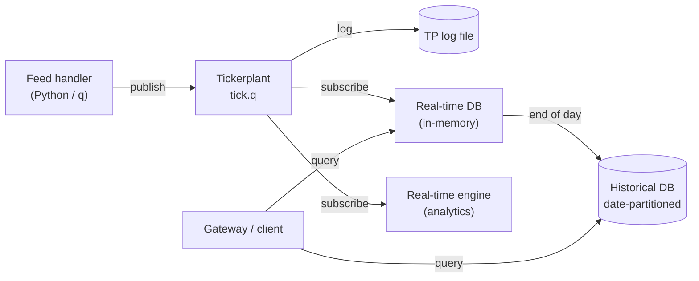

# kdb+/q Tick Data Analytics

Real-time market data capture and analytics platform built in **kdb+/q**, following the standard kdb+ tick architecture: feed handler → tickerplant → real-time database → historical database. Built as the capstone project of the KX kdb+/q developer curriculum.

<!-- TODO: adjust the sentence above if the project scope differs -->

## Architecture



| Component | Role | Port |
|---|---|---|
| Feed handler | Generates or replays trades and quotes, publishes to the tickerplant | – |
| Tickerplant | Timestamps updates, writes the log, publishes to subscribers | `5010` |
| RDB | Holds intraday data in memory, writes down to the HDB at end of day | `5011` |
| RTE | Computes real-time analytics (VWAP, OHLC bars, spreads) | `5012` |
| HDB | Date-partitioned on-disk database, `sym`-parted and sorted by `time` | `5013` |

<!-- TODO: replace ports and components with the ones actually used in the code -->

## Schema

```q
trade:([] time:`timespan$(); sym:`symbol$(); price:`float$(); size:`long$())
quote:([] time:`timespan$(); sym:`symbol$(); bid:`float$(); ask:`float$(); bsize:`long$(); asize:`long$())
```

## Example queries

```q
/ 5-minute OHLC bars
select open:first price, high:max price, low:min price, close:last price, volume:sum size
  by sym, bar:5 xbar time.minute from trade where date=.z.d-1

/ VWAP per symbol
select vwap:size wavg price by sym from trade where date=.z.d-1

/ Trades enriched with the prevailing quote (as-of join)
aj[`sym`time; select from trade where date=.z.d-1; select from quote where date=.z.d-1]

/ Average quoted spread in basis points
select spread_bps:avg 1e4*(ask-bid)%0.5*ask+bid by sym from quote where date=.z.d-1
```

## Getting started

Requirements: kdb+ 4.x (free personal licence from KX), Python 3.10+ with `pykx` for the feed handler.

```bash
git clone https://github.com/matthieu-briche/kdb-q-tickdata-analytics.git
cd kdb-q-tickdata-analytics

q tick.q sym . -p 5010          # tickerplant
q tick/r.q :5010 -p 5011         # RDB
q hdb -p 5013                    # HDB
python feed.py                   # feed handler
```

<!-- TODO: replace the commands with the real file names and start-up scripts -->

## Repository structure

```
.
├── tick.q            # tickerplant
├── tick/
│   ├── r.q           # real-time database
│   └── u.q           # pub/sub utilities
├── sym.q             # table schemas
├── feed.py           # feed handler
├── hdb/              # historical database (generated)
└── queries/          # analytics examples
```

<!-- TODO: update to match the real folder layout -->

## What this project demonstrates

- End-to-end kdb+ tick architecture with pub/sub over IPC
- Tickerplant logging and log replay for recovery
- End-of-day write-down to a date-partitioned, `sym`-parted HDB
- Time-series analytics in q: `xbar`, `wavg`, `aj`
- Python ↔ kdb+ integration

## Author

**Matthieu Briche** · Data Engineer, kdb+/q & Python · [LinkedIn](https://www.linkedin.com/in/matthieu-briche-aa69b441/)
