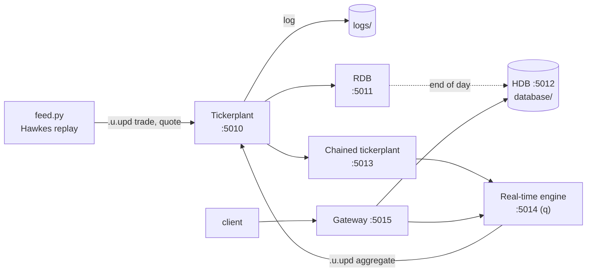

# kdb+/q Tick Data Analytics

A complete kdb+ tick architecture driven from Python with **PyKX**: feed handler → tickerplant → real-time database, a chained tickerplant feeding a real-time engine, a partitioned historical database, and a gateway that queries both real-time and historical data.

Market data is not random noise: quotes arrive as a **self-exciting Hawkes process**, so activity clusters in bursts the way it does on real order books. The same simulator feeds the historical database and the live stream.

> All data is simulated. The analytics that run inside kdb+ (real-time aggregation, query APIs) are written in q; Python wires the processes together.

---

## Architecture



| Process | Port | Role |
|---|---|---|
| Tickerplant | 5010 | Timestamps updates, logs them, publishes to subscribers |
| RDB | 5011 | Today's `trade`, `quote` and `aggregate` tables in memory |
| HDB | 5012 | On-disk history: date-partitioned, sorted by `sym` with `p#`, gzip-compressed |
| Chained tickerplant | 5013 | Shields the main tickerplant from a slow analytics subscriber |
| Real-time engine | 5014 | Recomputes per-symbol analytics and publishes `aggregate` back to the tickerplant |
| Gateway | 5015 | Single entry point for clients, routes queries to the RTE and the HDB |

## Market data model

Each symbol's quote updates follow an exponential Hawkes process

$$\lambda(t) = \mu + \sum_{t_i<t} \alpha\, e^{-\beta (t-t_i)}$$

with a branching ratio $n=\alpha/\beta$ between 0.6 and 0.9 and a 20 ms memory ($1/\beta$). It is simulated through its cluster representation (immigrants, then generations of children), fully vectorised in NumPy. Simulated rates and Fano factors match the theory ($\mu/(1-n)$ and $1/(1-n)^2$). About 20 % of quote updates also print a trade at the prevailing bid or ask.

The model and its statistical validation in pure q are in [kdb-hawkes-simulation-one-day](https://github.com/matthieu-briche/kdb-hawkes-simulation-one-day).

## Schemas

```q
trade:    ([] time:`timespan$(); sym:`symbol$(); exchange:`symbol$(); sz:`long$(); px:`float$())
quote:    ([] time:`timespan$(); sym:`symbol$(); exchange:`symbol$(); bid:`float$(); ask:`float$(); bidsz:`long$(); asksz:`long$())
aggregate:([] time:`timespan$(); sym:`symbol$(); trdvol:`float$(); vwap:`float$(); maxpx:`float$(); minpx:`float$();
              bid:`float$(); ask:`float$(); spread_bps:`float$(); qrate:`float$())
```

## Real-time engine

The RTE post-processor is a q function. After each update it recomputes, at most once per second, one row per symbol and publishes it to the tickerplant as `aggregate`:

| Column | Meaning |
|---|---|
| `trdvol`, `vwap`, `maxpx`, `minpx` | traded notional, volume-weighted price, high and low of the day |
| `bid`, `ask`, `spread_bps` | latest quote and quoted spread in basis points |
| `qrate` | quote updates per second over the last 10 s, a live proxy for the Hawkes intensity |

## Query APIs

Registered as q functions on the RTE and the HDB, and exposed through the gateway:

| Gateway call | Runs on | Returns |
|---|---|---|
| `trade_count[sym; n_days]` | RTE + HDB | trades today, plus the last `n_days` of history |
| `intraday_vwap[sym]` | RTE | VWAP and volume per minute |
| `intraday_ohlc[sym; minutes]` | RTE | OHLC bars of any width (`xbar`) |
| `trade_context[sym]` | RTE | each trade with the prevailing quote (`aj`) and its slippage to the mid in bps |
| `daily_stats[sym; n_days]` | HDB | daily trades, volume, VWAP and realised volatility of the 1-minute mid |

Historical APIs always filter on `date` first so that only the needed partitions are read.

## Getting started

Requires Python 3.10+ and a kdb+ licence for PyKX (the free personal edition works).

```bash
pip install -r requirements.txt
python -c "import pykx; pykx.install_into_QHOME()"   # once: lets the q processes load PyKX

python create_database.py --days 10   # build the HDB in database/
python tick.py                        # terminal 1: start all processes
python feed.py --speed 10             # terminal 2: stream data (10 simulated seconds per second)
```

Query through the gateway:

```python
import pykx as kx

with kx.SyncQConnection(port=5015, username="analyst", no_ctx=True) as gw:
    print(gw("trade_count", "TSLA", 5))
    print(gw("intraday_ohlc", "AAPL", 5))
    print(gw("daily_stats", "MSFT", 10))
```

If Python crashes with a segmentation fault on large arrays, disable PyKX's kdb+ memory allocator with `export PYKX_NO_ALLOCATOR=true`.

Or connect to the HDB directly with q (`q database -p 5020`) and query it:

```q
/ 5-minute OHLC bars on the last day
select open:first px, high:max px, low:min px, close:last px, volume:sum sz
  by sym, bar:5 xbar time.minute from trade where date=last date

/ trades with the prevailing quote (as-of join)
aj[`sym`time; select from trade where date=last date; select time, sym, bid, ask from quote where date=last date]

/ average quoted spread in basis points
select spread_bps:avg 1e4*(ask-bid)%0.5*ask+bid by sym from quote where date=last date
```

## Query tuning

`python query_tuning.py` times, with q's own `\t`, how much a few choices matter on this HDB:

- filter order on a partitioned table (`date` first vs `sym` first)
- `sym` column with no attribute vs `g#` vs `p#`
- `s#` on `time` for range lookups

## Repository structure

```
.
├── config.py            # ports, symbols, Hawkes parameters, schemas
├── hawkes.py            # Hawkes market data generator (NumPy)
├── create_database.py   # builds the partitioned HDB
├── tick.py              # tickerplant, RDB, HDB, chained TP, RTE (q), gateway
├── feed.py              # feed handler: accelerated replay into the tickerplant
├── query_tuning.py      # partition, attribute and filter-order benchmarks
└── requirements.txt
```

## Origin

The architecture skeleton (PyKX `kx.tick` processes, feed handler, gateway) comes from the KX Academy PyKX course. I restructured the notebook into scripts and extended it:

- Hawkes-driven market data instead of uniform random data, for both history and live stream
- real-time engine rewritten in q, throttled, with VWAP, live spread and quote intensity
- query APIs in q (`aj` trade context, OHLC bars, daily realised volatility)
- query tuning turned into timed benchmarks

## Author

**Matthieu Briche** · kdb+/q & Python · [LinkedIn](https://www.linkedin.com/in/matthieu-briche-aa69b441/)
